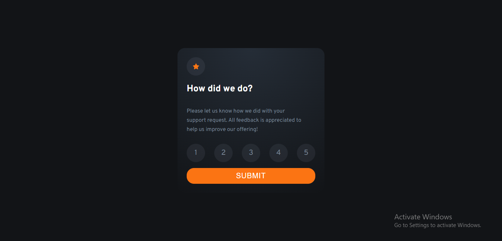
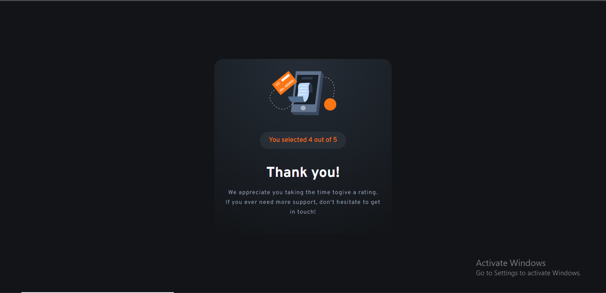
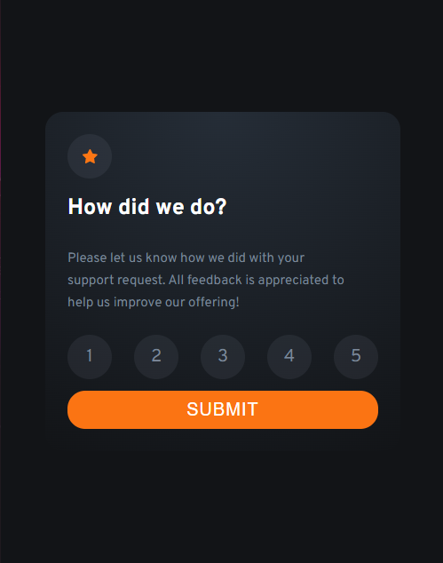
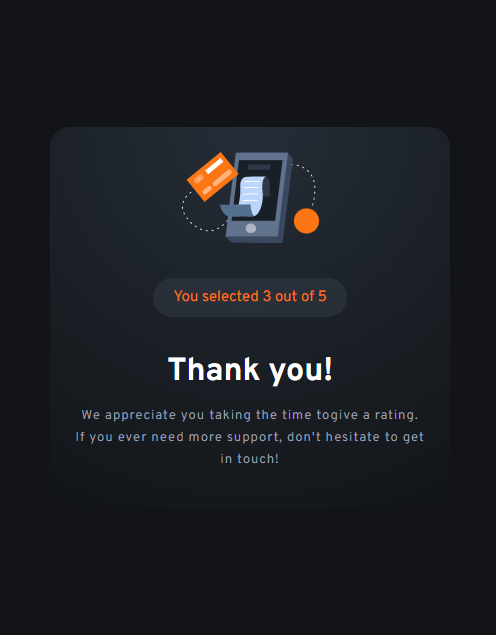

# Frontend Mentor - Interactive rating component solution

This is a solution to the [Interactive rating component challenge on Frontend Mentor](https://www.frontendmentor.io/challenges/interactive-rating-component-koxpeBUmI).
Frontend Mentor challenges helped me improve my coding skills by building this realistic project.

## Table of contents

- [Overview](#overview)
  - [The challenge](#the-challenge)
  - [Screenshot](#screenshot)
  - [Links](#links)
- [My process](#my-process)
  - [Built with](#built-with)
  - [What I learned](#what-i-learned)
  - [Continued development](#continued-development)
  - [Useful resources](#useful-resources)
- [Author](#author)

## Overview

### The challenge

Users should be able to:

- View the optimal layout for the app depending on their device's screen size
- See hover states for all interactive elements on the page
- Select and submit a number rating
- See the "Thank you" card state after submitting a rating

### Screenshot






### Links

- [Solution URL](https://aminezouari52.github.io/Frontend-Mentor-Interactive-rating-component/)

## My process

### Built with

- Semantic HTML5 markup
- CSS custom properties
- Flexbox
- Javascript
- eventListeners

### What I learned

In this project I've learnt alot of organisation skills, for example files management, how to store specific files in specific folders and how to access them.
Also, I've learnt how to use the SVG format, how to generate it and how to use it in the html file. Also how to set the icon in the header:

```html
<link
  rel="icon"
  type="image/png"
  sizes="32x32"
  href="./images/favicon-32x32.png"
/>
```

I've also learnt how to manage style variables in css, like
colors and fonts and store them in variables using root. And How to use the css gradient, for example:

```css
:root {
  --dark-blue: hsl(213, 20%, 18%);
  --very-dark-blue: hsl(216, 12%, 8%);
  --background-radiant: radial-gradient(
    circle at top,
    var(--dark-blue),
    var(--very-dark-blue)
  );
}
```

Another skill i've learnt is the max-width property, it was challenging to keep the elements width matching the desktop and mobiles devices.
It was also a good opportunity to practice my flex-box skills.

### Continued development

I want to be able to work on bigger and more complex projects because i find it challenging to style many elements that are in the same html file.
I also want to improve my javascript skills.

### Useful resources

- [google fonts](https://fonts.google.com/) - This website helped get the font i needed for this project. I really liked this API and will use it going forward.
- [gradient generator](https://cssgradient.io/) - This is an amazing website which helped me understand the concept of gradient. Not only does it generate the perfect gradient image that you need, but also it shows how the css code is done based on your needs.

## Author

- Frontend Mentor - [@aminezouari52](https://www.frontendmentor.io/profile/aminezouari52)
- Facebook - [amine zouari](https://www.facebook.com/amine.zouari.355/)
- LinkedIn - [amine zouari](www.linkedin.com/in/amine-zouari-724790223)
